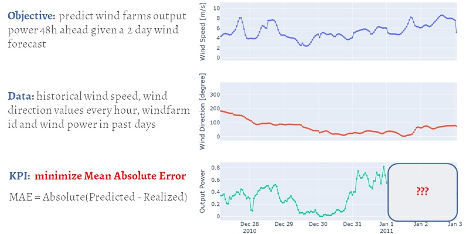

Windmill power prediction 
==============================

Data Science case for windmill power prediction based on weather. Based on Data Challenge of [Air Liquide](https://www.airliquide.com/) and [TotalEnergies](https://totalenergies.com/) companies in 2021.

__The link of the competition__: https://datascience.total.com/fr/challenge/19/details#

__Project presentation__: [[RU](https://docs.google.com/presentation/d/1_LnCRoTVObppkohVuFIcRWabu_nkG4Dc6QPrGgQGpPQ/edit?usp=sharing) / [EN](https://docs.google.com/presentation/d/1L5D4HqUiLyIuLWJv-6U4-XkU2T1NHDX-7N43LSzwwHU/edit?usp=sharing)]

__Raw data__: https://drive.google.com/drive/folders/1FtEotBMIuILnc5K01aLj4z1X2GfdkdyN

__Raw data__: https://drive.google.com/drive/folders/1FtEotBMIuILnc5K01aLj4z1X2GfdkdyN



__NOTE:__  
Because of local issues you could find ~`SSLVerify=False` syntax. It is also one of the reason to use `conda` instead of `poetry`. It could be omitted if you do not have problems with SSL.

# 1. Project structure

    ├── LICENSE
    ├── README.md          <- The top-level README for developers using this project.
    ├── data
    │   ├── external       <- Data from third party sources.
    │   ├── interim        <- Intermediate data that has been transformed.
    │   ├── processed      <- The final, canonical data sets for modeling.
    │   └── raw            <- The original, immutable data dump.
    │
    ├── docs               <- A default Sphinx project; see sphinx-doc.org for details.
    │
    ├── models             <- Trained and serialized models, model predictions, or model summaries.
    │   ├── metadata       <- Support files for model train/test.
    │   ├── prediction     <- Generated predictions by `predict_model` step.
    │   ├── lm_model.pkl   <- Saved model.
    │   └── metrics.json   <- Metrics of last model train and test.
    │
    ├── notebooks          <- Jupyter notebooks. Naming convention is a number (for ordering),
    │   |                     the creator's initials, and a short `-` delimited description, e.g.
    │   |                     `0.0.Parshin-windfarms-analysis.ipynb`.
    │   └── project_describtion.ipynb   <- Common sandbox which going to be documentation for the 
    │                         project.
    │
    ├── references         <- Data dictionaries, manuals, and all other explanatory materials.
    │
    ├── reports            <- Generated analysis as HTML, PDF, LaTeX, etc.
    │   └── figures        <- Generated graphics and figures to be used in reporting.
    │       |
    │       ├── exploratory<- Forlder to store exploratory analysis artifacts.
    │       └── importance <- Folder to store feature importance investigations artifacts.
    │
    ├── sample_request     <- Examples of data and commands for API service. 
    │
    ├── setup.py           <- makes project pip installable (pip install -e .) so src can be imported.
    ├── src                <- Source code for use in this project.
    │   ├── __init__.py    <- Makes src a Python module.
    │   │
    │   ├── app               <- Scripts for API service.
    │   │   └── inference.py  <- General script for API service.
    │   │
    │   ├── data           <- Scripts to download or generate data.
    │   │   │ 
    │   │   ├── aggregate_weather_config.py  <- Config for `aggregate_weather.py`.
    │   │   ├── aggregate_weather.py         <- Main script. Aggregate weather features in chosen way.
    │   │   ├── process_weather.py           <- Proccess script for `affrefate_weather.py`.
    │   │   ├── clip_outliers.py             <- Clip outlier data based on predefined method.
    │   │   ├── merge_data.py                <- Merge several files of dataset.
    │   │   └── split_train_predict.py       <- Split dataset on train and predict datasets.
    │   │
    │   ├── features       <- Scripts to turn raw data into features for modeling.
    │   │   │ 
    │   │   ├── create_features_config.py    <- Config for `create_features.py`.
    │   │   ├── create_features.py           <- Main script. Create chosen in config features in chosen 
    │   │   │                                   order.
    │   │   ├── math_functions.py            <- Math functions to prepare features.
    │   │   └── process_features.py          <- Process script for features in `create_features.py`.
    │   │
    │   ├── models         <- Scripts to train models and then use trained models to make
    │   │   │                 predictions.
    │   │   ├── explore_train_model.py  <- Explore model, make cross-validation, choose parametrs for
    │   │   │                              the model and train best model.    
    │   │   └── predict_model.py        <- Make predictions based on prediction dataset.
    │   │
    │   └── visualization  <- Scripts to create exploratory and results oriented visualizations.
    │       │ 
    │       ├── plot_exploratory.py         <- Make exploratory analysis.
    │       ├── plot_feature_importance.py  <- Explore feature importance.
    │       └── plot_unitls.py              <- Common functions for any plot.
    │
    ├── Docker             <- Services dockerfiles and required for building files.
    │   ├── minio          <- For Docker volume for `minio` service.
    │   ├── mlflow_image   <- Folder for files to create mlflow image.
    │   ├── model_service  <- Folder for files to create API.
    │   ├── pgadmin        <- For Docker volume for `pgadmin` service.
    │   └── nginx.conf     <- Config for nginx for nginx image.
    │
    ├── .dvc               <- Folder for `DVC` files (`DVC` - data version control and DAG - directed 
    │   │                     acyclic graph service)
    │   └── config         <- Config for dvc with params for remote service like S3
    │
    ├── .github            <- Folder for `githib` services, CI/CD
    │   │                     
    │   ├── workflows
    │   │   └── python-codestyle.yml <- CI file for github
    │   │
    │   ├── config_s3      <- `S3` config adapted for `CI/CD`
    │   │
    │   └── dvc_.yaml      <- `DVC` config adapted for `CI/CD`
    │
    ├── .env.example       <- `.env` example with mandatory variables 
    │
    │
    ├── conda.yml          <- The requirements file for reproducing the analysis environment, e.g.
    │                         generated with `conda env export > conda.yml` and reproducable by 
    │                         `conda env create -n windmill_power_prediction -f conda.yml`
    │
    ├── conda_win.yml      <- As `conda.yml` but for windows-only
    │
    ├── dvc.lock           <- `DVC` file to track changes in versioned files
    │
    ├── dvc.yaml           <- `DVC` file with DAG pipeline of the project 
    │    
    ├── pyproject.toml     <- toml file with settings for linters etc.
    │    
    └── tox.ini            <- for `flake8` params

# X. TODO

1. Make workflow shorted (the problem is in long conflict resolution in conda)
2. Make service to write predictions into Postgre (on clear PostgreSQL without SQLAlchemy)
3. Finish GitHub CI/CD
4. Fully test service in the cloud
5. Integrate CatBoost into sklearn.pipeline
6. Create front-end (Grafana/Dash/streamlit)

# XX. Useful commands
Useful commands for the servies:
```bash
# To fill database by data from ./data/interim/data_agg_weather.csv (before run `dvc repro` to create such file)
cd ./Docker/postgres/ && make init_insert_db
```

Useful docker commands:
```bash
# create image for mlflow
docker build -f Docker/mlflow/Dockerfile -t wpp_mlflow_server .
# create image for API service
docker build -f Docker/model_service/Dockerfile -t wpp_model_service .
# general command to build and run all docker services in `docker-compose.yml`
docker-compose up -d --build
# if it is required to build and run specific service
docker-compose up -d --build app
# if you set up data science env for experimetns (if you use remote S3, then use "db pgadmin mlflow" only)
docker-compose up -d --build minio nginx db pgadmin mlflow 
# to replace files in docker without creating new image and building container
docker cp ./inference.py wpp_model_service:/code/app/inference.py
```

To connect to database in pgadmin use:
```bash
# find the image postgres / container wpp_postgres, copy `CONTAINER ID`
docker ps
# copy "IPAddress" in the end of the file, use it for database connection in `pgadmin`
docker inspect `CONTAINER ID`
```

To add S3-like (not AWS S3) as dvc remote use the following commands:
```bash
dvc remote add -d remote s3://windmill-power-prediction/dvc
dvc remote modify remote endpointurl http://127.0.0.1:5441
```
then add `access_key_id` and `secret_access_key` in `./dvc/config`.

Check wheather port is busy in Windows/cmd (e.g. 5443)
```bash
netstat -a -n -o | find "5443"`
```

Conda commands
```bash
# Export env
conda env export > conda.yml
# Import env
conda env create -n windmill_power_prediction -f conda.yml
```

Other DVC commands
```bash
dvc push ./data/raw/test.csv ./data/raw/train.csv ./data/raw/wp1.csv ./data/raw/wp2.csv ./data/raw/wp3.csv ./data/raw/wp4.csv ./data/raw/wp5.csv ./data/raw/wp6.csv
```

<p><small>Project based on the <a target="_blank" href="https://drivendata.github.io/cookiecutter-data-science/">cookiecutter data science project template</a>. #cookiecutterdatascience</small></p>

# Contacts
Parshin Sergei / @ParshinSA / Sergei.A.P@yandex.com
